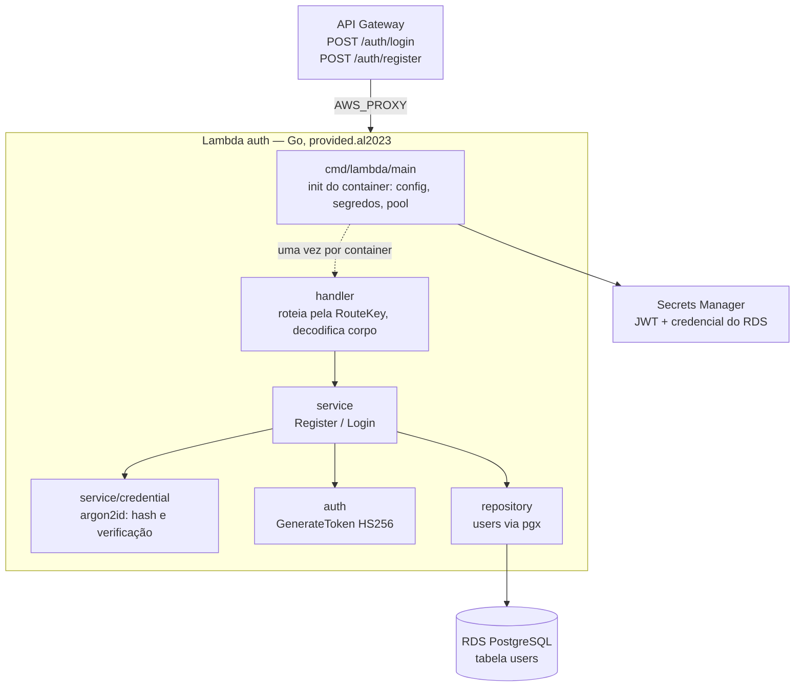
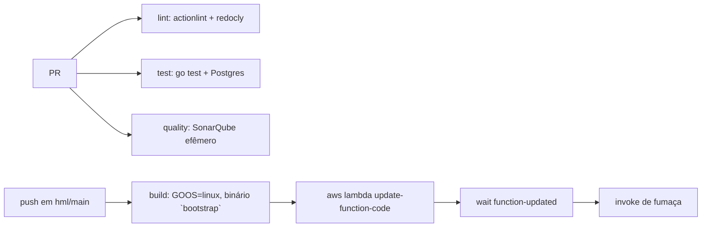

# oficina-mecanica-serverless

Função de autenticação da plataforma. Uma Lambda em Go que serve
`POST /auth/login` e `POST /auth/register` atrás do API Gateway, e emite o JWT
que o [`oficina-mecanica-monolith`](https://github.com/SOAT-15-Oficina/oficina-mecanica-monolith)
valida.

> **Visão de arquitetura do sistema completo** vive em
> [`oficina-mecanica-infrastructure`](https://github.com/SOAT-15-Oficina/oficina-mecanica-infrastructure).
> Este README cobre apenas este repositório.

## Fronteiras

Esta função **lê e escreve na tabela `users` do mesmo RDS** que o monolito usa.

Isso é deliberado: `users.id` é alvo de chave estrangeira em
`work_orders.opened_by_user_id` e `work_orders.assigned_technician_id`. Dar um
banco próprio a esta função quebraria as duas FKs e o fluxo de abertura de OS.

| | |
|---|---|
| **Dono do schema** | `oficina-mecanica-monolith` (`database/migrations`) |
| **Migrations rodadas aqui** | nenhuma — esta função depende do schema já existir |
| **CRUD administrativo `/users`** | fica no monolito |
| **Criação da função, VPC, IAM, API Gateway** | `oficina-mecanica-infrastructure` |

`tests/bootstrap.sql` é um **recorte** de `users` para uso local e no CI, não a
fonte da verdade. Se a definição da tabela mudar no monolito, atualize-o.

## Contrato do token

Uma cópia de `AppClaims`/`GenerateToken`/`ParseToken` vive em `internal/auth/`
aqui **e** no monolito. São ~40 linhas — não valem um módulo Go compartilhado
(que exigiria `GOPRIVATE` e deploy key nos dois CIs) nem um quinto repositório.

O que impede as cópias de divergirem é o fixture `internal/auth/testdata/token.golden`:
byte a byte o mesmo arquivo nos dois repositórios, com expiração fixa em 2099.
Cada repo tem um teste que o parseia. Renomear um claim ou trocar o algoritmo de
assinatura quebra o build dos dois, em vez de virar 401 em produção.

```bash
go run ./tools/gentoken > internal/auth/testdata/token.golden
cp internal/auth/testdata/token.golden \
   ../oficina-mecanica-monolith/internal/auth/testdata/token.golden
```

Regenere e copie **no mesmo PR**.

## Arquitetura deste repositório



Duas rotas numa única função: duas Lambdas dobrariam infraestrutura e cold
starts sem ganho. O `RouteKey` do evento decide qual caminho seguir.

Tudo que é caro acontece no **init do container**, não por invocação: leitura dos
segredos e abertura do pool. Em container reutilizado, a invocação já encontra
tudo pronto. `MaxConns` por container é baixo de propósito — concorrência de
Lambda multiplica pools, e o teto real é o `max_connections` do RDS.

**Fluxo de deploy deste repositório:**



## Contrato da API

| | |
|---|---|
| OpenAPI (fonte) | [`docs/openapi.yaml`](docs/openapi.yaml) |
| Rotas | `POST /auth/login`, `POST /auth/register` |
| Em um ambiente no ar | `<URL_PUBLICA>/api/auth/login` |

O contrato cobre **apenas** `/auth/*`. O resto da API tem contrato próprio no
[`oficina-mecanica-monolith`](https://github.com/SOAT-15-Oficina/oficina-mecanica-monolith/blob/main/docs/swagger.yaml).
Os dois são disjuntos por desenho: nenhum documenta rota do outro.

```bash
# exemplo
curl -X POST "$BASE/api/auth/login" \
  -H 'Content-Type: application/json' \
  -d '{"username":"admin","password":"..."}'
# → {"token":"eyJ..."}
```

## Deploy ativo

O ambiente é **efêmero**. A URL pública é estável entre ciclos e fica no SSM:

```bash
aws ssm get-parameter --name /oficina-mecanica/prod/public_base_url \
  --query Parameter.Value --output text
```

| Ambiente | URL |
|---|---|
| Produção | `/oficina-mecanica/prod/public_base_url` |
| Homologação | `/oficina-mecanica/homolog/public_base_url` |

## Estrutura

```
cmd/lambda/          bootstrap: config, pool, handler, lambda.Start
internal/
  auth/              AppClaims + Generate/ParseToken + fixture de contrato
  config/            env + Secrets Manager (com fallback local)
  domain/            User e UserRole
  handler/           roteamento por RouteKey, tradução de erro → HTTP
  repository/        adaptador pgx da tabela users
  service/           argon2 (hash/verify) + Register/Login
tools/gentoken/      gerador do fixture de contrato
docs/openapi.yaml    contrato — apenas /auth/*
tests/bootstrap.sql  recorte de `users` para local e CI
```

## Rodando local

```bash
docker compose up --build
```

Sobe a função no **Lambda Runtime Interface Emulator** com um Postgres ao lado.
Sem `DATABASE_SECRET_ID`/`JWT_SECRET_ID` no ambiente, o config lê direto das
variáveis e **não chama o Secrets Manager** — não há AWS envolvida.

```bash
curl -s localhost:9000/2015-03-31/functions/function/invocations -d '{
  "routeKey": "POST /auth/register",
  "body": "{\"username\":\"admin\",\"password\":\"admin123\",\"role\":\"admin\"}"
}'
```

Para o fluxo completo (front + Lambda + monolito atrás de um nginx que replica o
roteamento do CloudFront), use `docker-compose.local.yml` no repositório de
infraestrutura.

## Testes

```bash
go test ./... -short                      # unitários, sem banco
TEST_DATABASE_URL=postgres://... go test ./...   # inclui integração
go test ./... -coverprofile=coverage.out
```

Os testes de integração de `internal/repository` pulam sozinhos quando
`TEST_DATABASE_URL` não está definida.

## Qualidade

```bash
docker compose -f docker-compose.sonar.yml up -d sonarqube   # :9001
go test ./... -coverprofile=coverage.out
docker compose -f docker-compose.sonar.yml run --rm sonar-scanner
```

O CI sobe uma instância equivalente como service container efêmero e o Quality
Gate **bloqueia o merge**. Sem histórico entre execuções, o gate é avaliado sobre
o código todo, não sobre *new code*.

## Empacotamento e deploy

Produção é um **zip com um binário `bootstrap`** em `provided.al2023`, compilado
para **arm64** (Graviton). Sem container image: o binário tem poucos MB e o cold
start fica em ~50–150ms, mais o ENI da VPC na primeira invocação.

```bash
CGO_ENABLED=0 GOOS=linux GOARCH=arm64 go build -o dist/bootstrap ./cmd/lambda
(cd dist && zip -X function.zip bootstrap)
```

O CI faz isso e publica com `aws lambda update-function-code`, resolvendo o nome
da função no SSM:

| Parâmetro | Uso |
|---|---|
| `/oficina-mecanica/<ambiente>/auth_lambda_name` | alvo do `update-function-code` |

A função é **criada pelo Terraform** com um zip placeholder e
`lifecycle.ignore_changes` no código: o **artefato** é propriedade deste
pipeline; **VPC, memória, timeout, role e variáveis de ambiente** são
propriedade do repositório de infraestrutura.

### Dois ambientes

A **branch** escolhe o destino: `hml` publica em homologação, `main` em produção.
Não há input de ambiente em lugar nenhum deste repositório — o `ref` já carrega a
informação, e um input separado poderia contradizê-lo.

| | homologação | produção |
|---|---|---|
| Branch | `hml` | `main` |
| GitHub Environment | `homolog` | `production` |
| Prefixo no SSM | `/oficina-mecanica/homolog` | `/oficina-mecanica/prod` |

Por isso `AWS_DEPLOY_ROLE_ARN` é secret de **GitHub Environment**, não de
repositório: os dois ambientes usam o mesmo nome de secret e apenas o escopo do
Environment os separa. A trust policy da role repete a regra do lado da AWS — um
push em `hml` não obtém credencial de produção.

Arquitetura completa dos dois ambientes: `oficina-mecanica-infrastructure`.

### Secrets e variables necessários

| Nome | Tipo | Conteúdo |
|---|---|---|
| `AWS_DEPLOY_ROLE_ARN` | secret de **Environment** (`production` e `homolog`) | role assumida por OIDC (`lambda:UpdateFunctionCode` + SSM) |
| `CI_DATABASE_PASSWORD` | secret | senha do Postgres do job de teste |
| `AWS_REGION` | variable | `sa-east-1` |

## Rede e segredos em produção

A função roda **dentro da VPC, em subnets privadas**, com SG próprio liberado no
SG do RDS na 5432 — o banco nunca é exposto à internet. Credencial do RDS e
chave JWT vêm do **Secrets Manager**, lidos uma vez por container (não por
invocação): em container reutilizado já estão em memória.

O pool tem teto baixo de conexões por container, porque concorrência de Lambda
multiplica pools. Se o volume de login crescer, o próximo passo é **RDS Proxy**,
não aumentar esse número.
